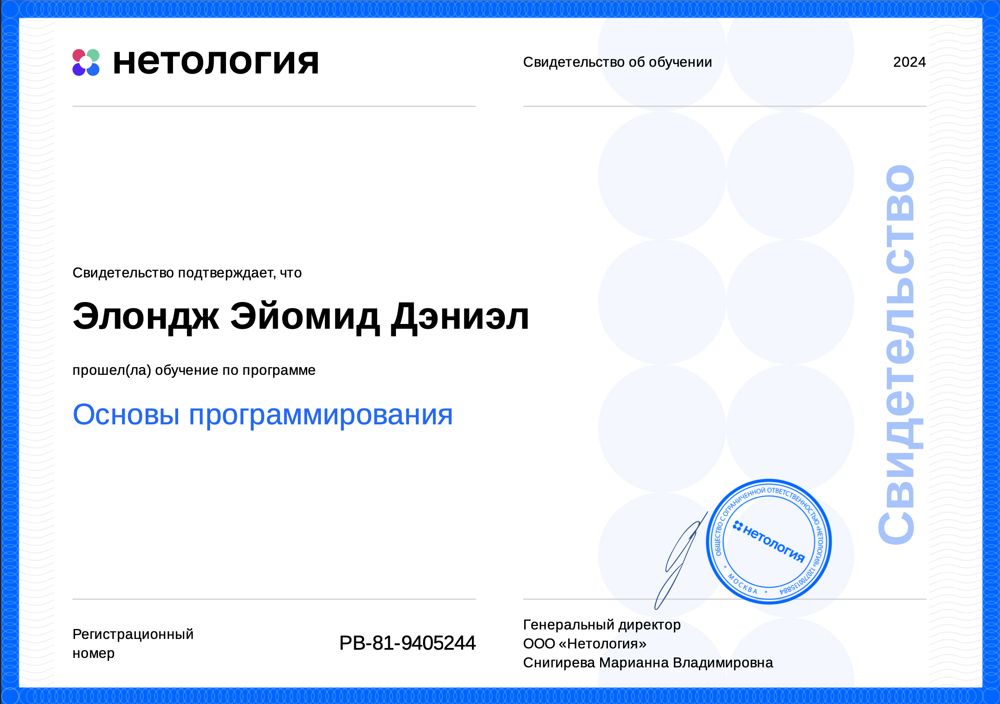
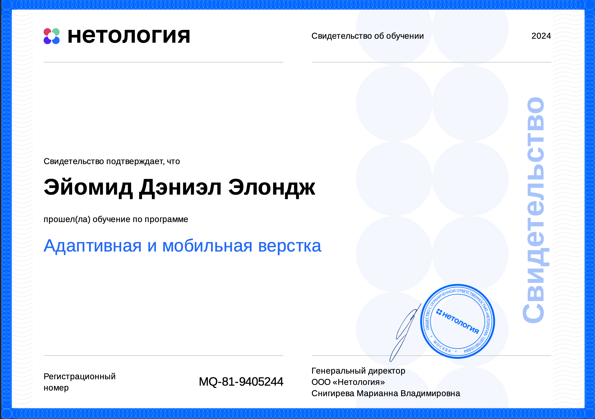
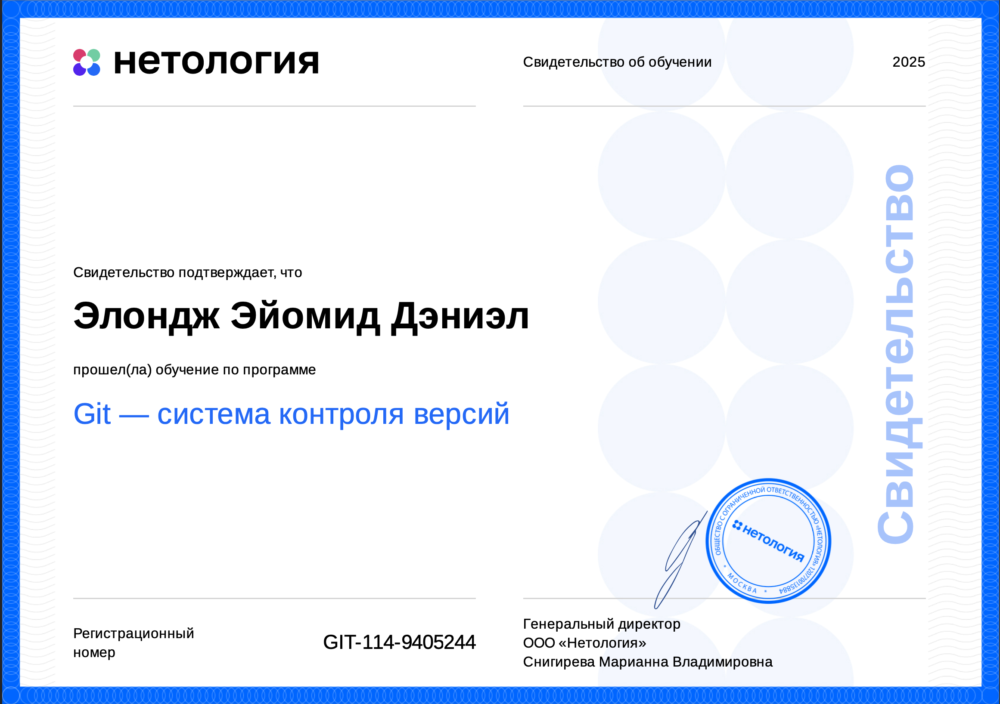
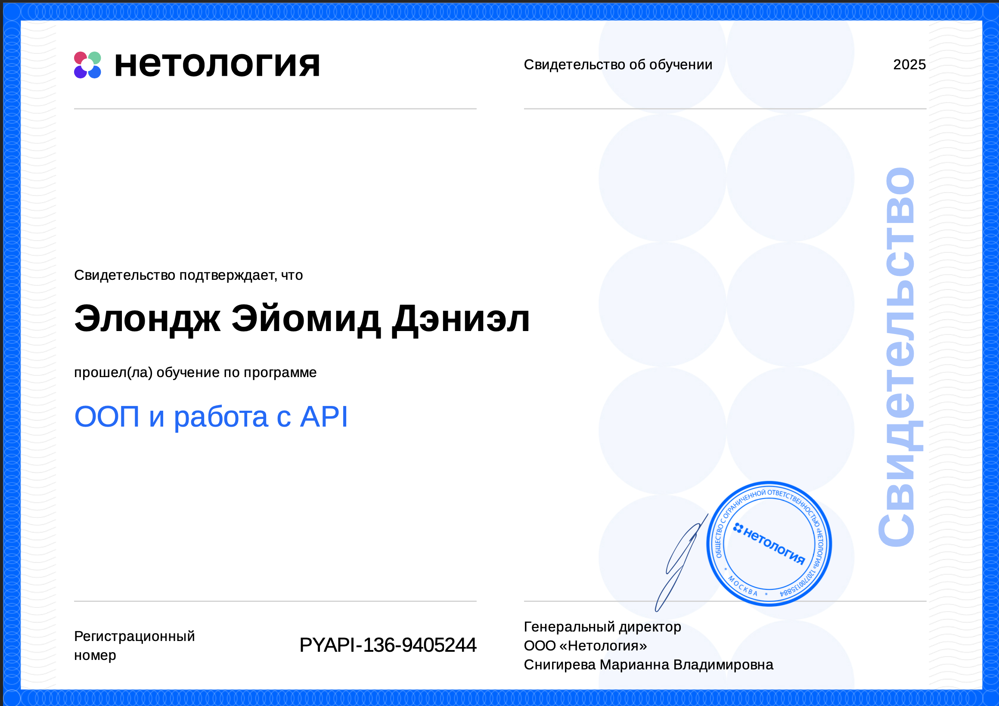
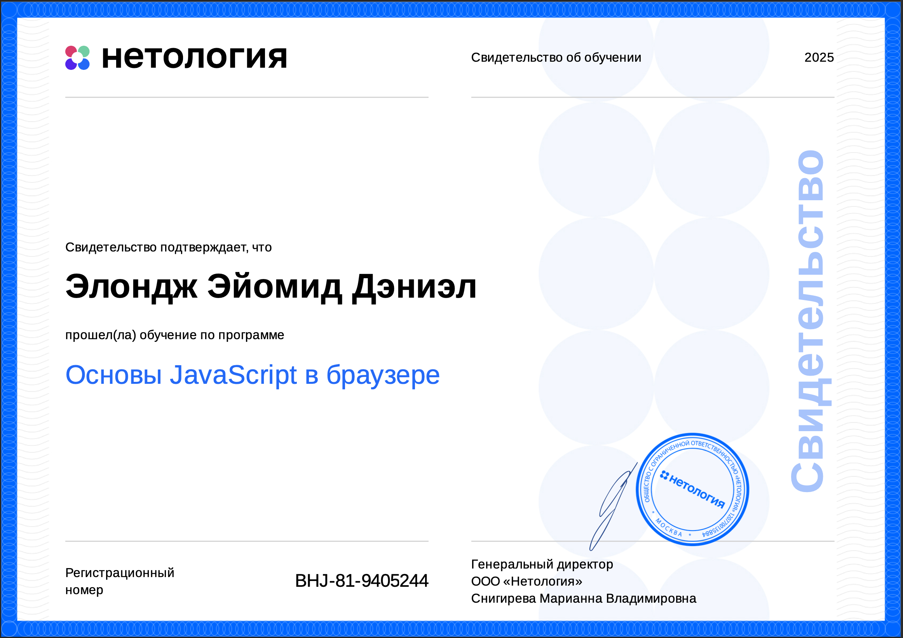
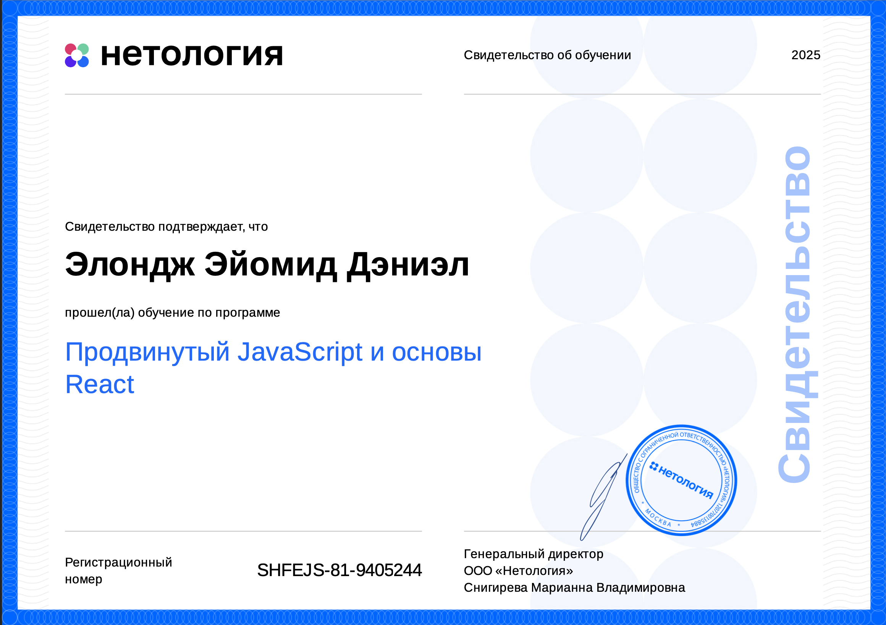

# 🏅 My Certificates

Here are my certificates:
> 🚀 **Note:** I am currently studying until **February 2026**.  
> More certificates, projects, and skills will continue to be added as I progress.

## BASIC PROGRAMMING

## ADAPTATION AND MOBILE VERSION

## GIT SYSTEM CONTROL

## WORKING WITH API

## BASIC JAVASCRIPT

## USING REACT JS

## PYTHON

## Skills
	•	Languages: Python, HTML, CSS, JavaScript
	•	Frameworks: Django, Flask
	•	Databases: MySQL, SQLite
	•	Version Control: Git, GitHub
	•	Tools: VS Code, Postman, Docker
	•	Web Technologies: RESTful APIs, JSON, AJAX, Cloud services (AWS, CLOUDFARE, DIGITAL OCEAN, GOOGLE CONSOLE)

## Projects (All links are located on Github)
- [Задача для веб- и fullstack - разработчиков от Digital агентства Победа](https://github.com/Thor-ux/digitaltask): Bеб-приложение на Flask + SQLite с фронтендом на vanilla JS и Bootstrap.
- [Self-Task](https://github.com/Thor-ux/NODE): E.O.Node is a real-time, ephemeral chat application built with Node.js, Express, and Socket.io.
- [Self-Task1](https://github.com/Thor-ux/videofun): A full-featured video platform built with Node.js, Express, and MongoDB, featuring video uploads, likes, comments, analytics tracking, and user authentication.

## My page Repositories
- [page](https://github.com/Thor-ux?tab=repositories): This is my repository on Github.